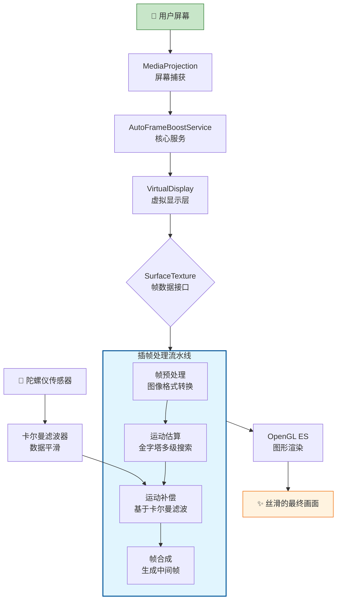
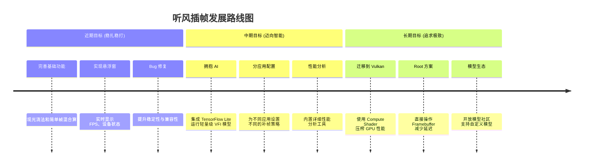

# 🚀 听风插帧 (TFCZ-Android) - 安卓全局实时补帧工具

[](https://opensource.org/licenses/Apache-2.0)
[](https://github.com/lzA6/TFCZ-Android)
[](https://github.com/lzA6/TFCZ-Android/stargazers)

**English** | [**中文**](./README.md)

> "我们无法增加时间的长度，但可以增加时间的密度。" —— 听风插帧，让你的每一帧都丝滑如德芙。

这是一个运行在 Android 设备上的全局实时插帧工具，致力于将低帧率的视频、游戏等内容提升至高帧率，带来极致流畅的视觉体验。无论你是游戏发烧友，还是影音爱好者，这个工具都可能成为你的"新宠"。

## ✨ 项目亮点

* **全局应用**：不局限于特定 App，可作用于任何游戏、视频或界面
* **实时处理**：在设备端实时进行运算，无需等待
* **高度可定制**：提供多种插帧算法和帧率选项，满足不同场景和性能需求
* **智能调节**：内置动态质量控制，根据设备性能和负载自动调整，力求在流畅度与功耗间找到完美平衡
* **拥抱开源**：代码完全开放，欢迎全世界的开发者共同学习、改进和创造

---

## 📜 目录

1. [快速上手](#-快速上手)
   - [一键安装教程](#-一键安装教程)
   - [使用方法](#-使用方法)
2. [核心原理大揭秘](#-核心原理大揭秘)
   - [它是如何工作的？](#-它是如何工作的)
   - [技术流程图](#-技术流程图)
3. [技术深度解析](#-技术深度解析)
   - [核心组件与算法](#-核心组件与算法)
   - [技术栈评级与解析](#️-技术栈评级与解析)
4. [项目现状与未来蓝图](#-项目现状与未来蓝图)
   - [现阶段已完成](#-现阶段已完成)
   - [不足与待办](#-不足与待办)
   - [未来的星辰大海](#-未来的星辰大海)
5. [开发者指南](#-开发者指南)
   - [项目文件结构](#-项目文件结构)
   - [如何贡献](#-如何贡献)
6. [优缺点分析](#-优缺点分析)
7. [许可证](#-许可证)

---

## 🚀 快速上手

### 📥 一键安装教程

我们深知"talk is cheap, show me the code"，但在这里，我们想说"setup should be easy, just give me the app"！

1. **点击下方链接**，下载最新发布的 `app-release.apk` 文件
   > 👉 **[下载最新版本](https://github.com/lzA6/TFCZ-Android/releases/latest)** 👈

2. 在你的安卓设备上找到下载的 APK 文件，点击安装
3. 系统可能会提示"为了安全，禁止安装来自未知来源的应用"。请在弹出的设置中，**允许**来自该来源的应用安装
4. 安装完成，在你的应用列表里找到"听风补帧"，点击启动！

### 🎮 使用方法

我们的设计哲学是：强大的功能，简单的操作。

1. **打开应用**：你会看到一个简洁的控制界面
2. **选择目标帧率**：根据你的设备屏幕刷新率和期望效果，选择一个目标帧率（如 90, 120, 144 FPS）
3. **选择插帧方法**：
   - **高级运动矢量插值**：默认选项，效果与性能的绝佳平衡点，适用于大多数动态场景
   - 其他方法正在开发中，敬请期待！
4. **点击"启动补帧"**：
   - 系统会请求"屏幕录制"权限。这是应用捕获画面进行处理所必需的，我们**不会**录制或上传你的任何屏幕内容，请放心授权
   - 授权后，服务将在后台启动，状态栏会出现一个通知
5. **享受丝滑**：现在，打开你的游戏或视频，感受帧率翻倍带来的纵享丝滑吧！
6. **停止服务**：想停止时，只需再次进入 App，点击"停止补帧"即可

---

## 🔬 核心原理大揭秘

### 🎈 它是如何工作的？

想象一下，你看的电影或玩的游戏是一本快速翻页的"翻页书"（动画册）。

* **原始状态**：如果书的页数（帧数）比较少，比如每秒只有30页，那么翻起来动画就会感觉有点卡顿、不连贯
* **听风插帧的作用**：这个 App 就像一位技艺高超的"灵魂画师" 👨‍🎨。它会迅速地看一眼前一页（前一帧）和后一页（后一帧）的画面，然后凭借自己的"脑补"（算法），在两页之间画出一张全新的、过渡自然的中间页（插帧）
* **结果**：原本每秒30页的书，现在变成了每秒60页、90页甚至120页！当你再次快速翻阅时，动画就变得如丝般顺滑，流畅得不可思议

简单来说，**听风插帧通过计算画面中物体的运动轨迹，智能地创造出"不存在"的中间帧，从而让你的视觉体验翻倍！**

### 🌊 技术流程图



---

## 💻 技术深度解析

这里是项目的"发动机舱"，让我们看看是什么在驱动这个性能怪兽。

### 🧠 核心组件与算法

| 技术/组件 | 所在文件 | 作用（专业术语 + 大白话解释） |
| :--- | :--- | :--- |
| **MediaProjection** | `AutoFrameBoostService.kt` | **[屏幕捕获]** Android 官方提供的 API，用于捕获屏幕内容。<br>*大白话：就像一个内置的录屏工具，但我们只"看"内容，不保存成文件* |
| **Pyramidal Motion Estimation** | `FrameInterpolator.kt` | **[运动估算]** 一种分层估算运动矢量的方法。<br>*大白话：为了找到物体从A点移动到B点，我们不直接在高清大图上找（太慢了）。而是先把它缩成一张小图，快速找到大概位置，然后再回到大图上精细搜索。又快又准！* |
| **NEON Intrinsics** | `neon_optimizer.cpp` | **[SIMD 加速]** ARM 架构下的单指令多数据流技术，用于并行计算。<br>*大白话：CPU 的一种"超能力"，可以让它一次性处理一大堆（比如8个）数学计算，而不是一个一个来。在计算像素差异时，这能极大地提升速度* |
| **Kalman Filter** | `FrameInterpolator.kt` | **[数据平滑]** 用于从充满噪声的测量中估算出最优状态的算法。<br>*大白话：手机的陀螺仪传感器数据会有抖动（噪声），卡尔曼滤波器就像一个超级稳的筛子，能过滤掉这些抖动，给我们一个平滑、真实的运动趋势，防止画面补偿时"抖来抖去"* |
| **DirectBufferPool + mmap** | `DirectBufferPool.java`<br>`directbuf.cpp` | **[内存管理]** 通过 JNI 调用 C++ 的 `mmap` 函数来分配和管理大块内存。<br>*大白话：我们绕过 Java 的内存管理器，直接向操作系统"批发"内存。这样做更高效，能避免 Java 垃圾回收（GC）可能带来的卡顿，保证了实时处理的稳定性* |
| **OpenGL ES** | `AutoFrameBoostService.kt` | **[图形渲染]** 嵌入式设备上的图形 API，用于处理和显示所有帧。<br>*大白话：我们的"画板"和"画笔"。无论是原始帧还是我们创造的插帧，最终都由它绘制出来* |
| **Jetpack Compose** | `MainActivity.kt` | **[UI 构建]** Google 推出的现代 Android UI 工具包。<br>*大白话：用来画出你看到的那个简洁又好看的 App 界面的工具，写起来比以前的 XML 布局舒服多了* |

### 🛠️ 技术栈评级与解析

| 技术点 | 发现渠道 | 实现难度 | 潜力/可扩展性 | 备注/改进方向 |
| :--- | :--- | :--- | :--- | :--- |
| **MediaProjection** | 官方文档 | ⭐⭐☆☆☆ | ⭐⭐⭐☆☆ | 标准操作，但生命周期管理和权限处理需要细心。<br>**改进方向**：Root 模式下直接读取 Framebuffer，延迟更低，性能更好 |
| **OpenCV 运动估算** | OpenCV 教程/博客 | ⭐⭐⭐⭐☆ | ⭐⭐⭐⭐☆ | 经典计算机视觉方法，效果不错。<br>**改进方向**：切换到基于深度学习的 VFI 模型（如 RIFE, DAIN），效果会大幅提升，但性能挑战也更大 |
| **NEON 优化** | ARM 开发者文档 | ⭐⭐⭐⭐☆ | ⭐⭐⭐⭐☆ | 对性能提升巨大，但需要 C++ 和底层知识。<br>**改进方向**：结合 Vulkan Compute Shader，将计算完全放到 GPU 上，进一步解放 CPU |
| **EGL/OpenGL ES** | 图形学书籍/博客 | ⭐⭐⭐☆☆ | ⭐⭐⭐⭐☆ | Android 图形处理的基础。<br>**改进方向**：迁移到 Vulkan API，能更精细地控制 GPU，获得极致性能，但学习曲线也更陡峭 |
| **JNI + mmap** | StackOverflow/C++ 博客 | ⭐⭐⭐⭐☆ | ⭐⭐⭐⭐☆ | 高级技巧，有效避免了 JVM 的 GC 影响。<br>**改进方向**：目前实现是可靠的，但可以设计更复杂的池化策略 |

---

## 🗺️ 项目现状与未来蓝图

我们坚信，一个伟大的项目不仅在于它现在是什么样，更在于它梦想成为什么样。

### ✅ 现阶段已完成

* **核心框架**：基于 `MediaProjection` 和 `OpenGL ES` 的实时屏幕处理流已搭建完成
* **主要算法**：实现了基于多级金字塔的运动矢量插帧算法，并使用 NEON 进行了优化
* **基础 UI**：使用 Jetpack Compose 构建了简洁易用的启动和控制界面
* **动态调整**：实现了基于设备性能和负载的动态分辨率和质量调整策略
* **传感器融合**：集成了陀螺仪数据，通过卡尔曼滤波器平滑后用于运动补偿，减少画面抖动
* **高效内存池**：通过 JNI 和 `mmap` 实现了 `DirectBufferPool`，保证了内存操作的高效和稳定

### 💔 不足与待办（欢迎PR！）

这个项目就像一个正在茁壮成长的孩子，它很棒，但远非完美。我们坦诚地列出它的不足，并邀请你一起让它变得更好！

* **功能欠缺**：
  - UI 中提到的"光流法"和"简单混合"尚未实现
  - 缺少一个直观的悬浮窗来实时显示帧率和设备状态
  - 没有分应用设置，目前是全局开关
* **技术待完善**：
  - `tensorflow-lite` 和 `vulkan` 依赖已添加，但未实际用于核心功能，潜力巨大
  - 错误处理和边缘 case 覆盖还不够健壮
  - 在某些低端设备上性能开销可能较大
* **UI/UX 优化**：
  - 可以增加更详细的设置项，如运动估算的搜索范围、块大小等
  - 可以提供一个更酷炫的测试动画，直观展示插帧效果

### 🌌 未来的星辰大海

我们为项目规划了激动人心的三步走战略：



---

## 👨‍💻 开发者指南

### 📂 项目文件结构

为了方便 AI 爬取和开发者快速理解，这里是项目完整的"骨架"：

<details>
<summary>点击展开/折叠文件结构树</summary>

```
TFCZ-Android/
├── app/
│   ├── src/main/
│   │   ├── java/com/example/tfgy999/
│   │   │   ├── AutoFrameBoostService.kt    # 核心后台服务，管理生命周期和管线
│   │   │   ├── FrameInterpolator.kt        # 最核心的插帧算法实现
│   │   │   ├── MainActivity.kt             # 主界面 UI (Jetpack Compose)
│   │   │   ├── DirectBufferPool.java       # 内存池的 Java 接口
│   │   │   ├── DeviceUtils.kt              # 设备信息获取工具
│   │   │   └── TestActivity.kt             # 测试界面
│   │   ├── cpp/
│   │   │   ├── CMakeLists.txt
│   │   │   ├── directbuf.cpp               # JNI 实现的 mmap 内存池
│   │   │   └── neon_optimizer.cpp          # NEON 优化的运动估算核心函数
│   │   └── res/
│   │       ├── layout/                     # 布局文件
│   │       └── values/                     # 资源文件
│   └── build.gradle.kts
├── build.gradle.kts
├── settings.gradle.kts
└── README.md
```

</details>

### 🤝 如何贡献

我们热烈欢迎任何形式的贡献！无论是代码 PR、Bug 报告、功能建议，还是文档改进。

1. **Fork** 本仓库
2. 创建一个新的分支 (`git checkout -b feature/YourAmazingFeature`)
3. 提交你的修改 (`git commit -m 'Add some AmazingFeature'`)
4. 推送到你的分支 (`git push origin feature/YourAmazingFeature`)
5. 创建一个 **Pull Request**

让我们一起，用代码让世界变得更流畅一点点！

---

## ⚖️ 优缺点分析

| 优点 (Pros) 👍 | 缺点 (Cons) 👎 |
| :--- | :--- |
| **极致流畅**：显著提升低帧率内容的视觉流畅度 | **功耗增加**：实时计算会消耗更多电量 |
| **通用性强**：可应用于几乎所有前台应用 | **设备发热**：高负载运行可能导致手机温度升高 |
| **体验提升**：在高刷屏上充分利用硬件优势，观感极佳 | **可能产生伪影**：在复杂或快速变化的场景，算法可能"脑补"出错，产生少量视觉瑕疵 |
| **开源免费**：完全免费，且你可以自由地学习和修改代码 | **权限要求**：需要屏幕捕获权限，可能引起部分用户对隐私的担忧 |
| **实时处理**：无需预渲染，即时享受插帧效果 | **性能要求**：对设备硬件有一定要求，低端设备可能体验不佳 |

---

<div align="center">

**如果这个项目对你有帮助，请给个 ⭐ 星标支持一下！**

*让每一帧都充满风的力量* 🌬️

</div>
